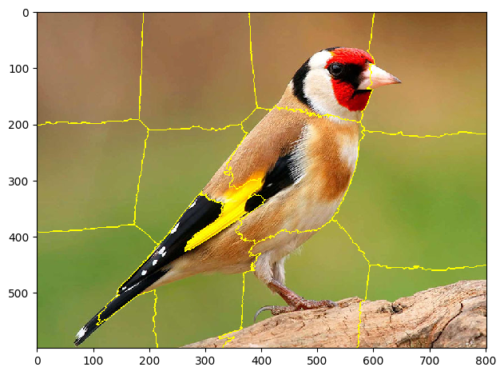

# Superpixel 
Superpixel Methods in Computer Vision using Python
Image of superpixel segmentation of an imageOpens in a new window
www.researchgate.net
superpixel segmentation of an image

Superpixel methods are a type of image segmentation technique that groups pixels into small, homogeneous regions called superpixels. These regions are typically more regular in shape and size than the individual pixels, which can make them easier to process and analyze. Superpixel methods can be used for a variety of tasks in computer vision, 

## Code
```python
import numpy as np
from skimage.segmentation import slic
from skimage.segmentation import mark_boundaries
from skimage.io import imread, imshow

image = imread('Hassoun.jpg')

# slic is a superpixel function in sciki
# the n_segment refer to the number of segemnts
# the compactness refer to the shape of each segment
segments = slic(image, n_segments=10, compactness=40)

# this function used for make boundaris to segments on the image
segmented_image = mark_boundaries(image, segments)
imshow(segmented_image)
```
## result
<div align='center' >

</div>